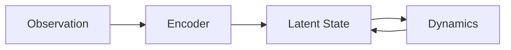

# Markdown Cheat Sheet (Praxis: Blog + Notes)

Use this guide when writing content for your site in VS Code.

## 1) Where to put files

- Blog posts (shown in `Blog`):
  - `src/content/research/<post-slug>.md`
  - URL: `/research/<post-slug>/`
- Notes chapters (shown in `Notes`):
  - `src/content/notes/<subject-slug>/<chapter-slug>.md`
  - URL: `/notes/<subject-slug>/<chapter-slug>/`

Use lowercase kebab-case for file names and folder names.

Example:

- `src/content/research/transformers-from-first-principles.md`
- `src/content/notes/world-models/an-introduction-to-world-models.md`

## 2) .md vs .mdx

- Use `.md` for normal writing (recommended).
- Use `.mdx` only when you need to embed components.

Your current setup supports all major writing features directly in `.md`.

## 3) Required frontmatter

### Blog template (`src/content/research/*.md`)

```yaml
---
title: My Blog Post
description: One-line summary shown in list and SEO.
pubDate: 2026-06-26
updatedDate: 2026-06-27 # optional
tags:
  - ai
  - world-models
draft: false
featured: false
---
```

### Notes chapter template (`src/content/notes/<subject>/<chapter>.md`)

```yaml
---
title: An Introduction to World Models
description: Short summary of this chapter.
pubDate: 2026-06-26
updatedDate: 2026-06-27 # optional
subject: World Models
chapter: 1
tags:
  - world-models
  - model-based-rl
draft: false
---
```

Important for Notes:

- Keep `subject` consistent across chapters in the same subject folder.
- `chapter` must be a positive integer (`1`, `2`, `3`, ...).

## 4) Headings and document structure

```md
# Title inside article

## Main section

### Subsection
```

Tip: Your table of contents uses `##` and `###`.

## 5) Text formatting

```md
**bold**
*italic*
~~strikethrough~~
`inline code`
```

## 6) Lists

```md
- unordered item
- another item

1. ordered item
2. ordered item

- [ ] todo item
- [x] done item
```

## 7) Links

```md
[OpenAI](https://openai.com)
[Blog post link](/research/world-models-first-principles/)
[Note chapter link](/notes/world-models/an-introduction-to-world-models/)
```

## 8) Images

Place image files in:

- `public/images/`

Then use:

```md

```

Caption style (simple):

```md

*Figure 1. High-level world model architecture.*
```

Custom size with HTML (optional):

```html

```

## 9) Code blocks

Use fenced blocks with language for syntax highlighting:

````md
```python
for step in range(1000):
    train_step()
```
````

````md
```bash
npm run dev
```
````

Your site automatically adds a copy button to code blocks.

## 10) Math equations (KaTeX)

Inline math:

```md
The transition model is $p(z_t \mid z_{t-1}, a_{t-1})$.
```

Block math:

```md
$$
\mathcal{L} = \lambda_r \lVert x_t - \hat{x}_t \rVert_2^2 + \lambda_p \, \mathrm{KL}(q \| p)
$$
```

Aligned equations:

```md
$$
\begin{aligned}
V^\pi(s) &= \mathbb{E}_\pi [G_t \mid S_t = s] \\
Q^\pi(s,a) &= \mathbb{E}_\pi [G_t \mid S_t = s, A_t = a]
\end{aligned}
$$
```

## 11) Mermaid diagrams

Use a fenced block with `mermaid`:

````md

````

Mermaid is rendered automatically on article pages.

## 12) Tables

```md
| Model | Strength | Weakness |
| --- | --- | --- |
| RSSM | Efficient latent rollouts | Long-horizon drift |
| Dreamer | Policy learning in imagination | Sensitive to model bias |
```

## 13) Callouts (GitHub-style alerts)

```md
> [!NOTE]
> Use this when you want to emphasize a key idea.

> [!TIP]
> Keep latent size small at first, then scale gradually.

> [!WARNING]
> Do not over-trust short-horizon reconstruction metrics.
```

Supported labels include: `NOTE`, `TIP`, `IMPORTANT`, `WARNING`, `CAUTION`.

## 14) Footnotes

```md
Posterior collapse can occur when the decoder dominates.[^collapse]

[^collapse]: The latent variable carries little information in this case.
```

## 15) Horizontal rule and blockquote

```md
---

> A concise quote or takeaway.
```

## 16) Escaping characters

If needed, escape markdown symbols with `\`:

```md
\*not italic\*
\$not math\$
```

## 17) Quick writing workflow

1. Create the `.md` file in the correct folder.
2. Add valid frontmatter.
3. Write content using this cheat sheet.
4. Preview locally:

   ```bash
   npm run dev
   ```

5. Open pages:
   - Blog list: `http://localhost:4321/research/`
   - Notes list: `http://localhost:4321/notes/`

6. Commit and push:

   ```bash
   git add <file-path>
   git commit -m "Add new post/chapter"
   git push origin main
   ```

7. Wait for GitHub Actions deploy, then hard refresh the live page.

## 18) Common issues and fixes

- Post/chapter not showing:
  - Check `draft: false`.
  - Confirm file path is in the correct collection folder.
- Notes chapter not under expected subject:
  - Ensure folder slug matches subject grouping.
  - Ensure `subject:` text is consistent.
- Math not rendering:
  - Check matching `$...$` or `$$...$$` pairs.
  - Escape underscores if needed.
- Image 404:
  - File must exist in `public/images/`.
  - Path should start with `/images/...`.
- Mermaid not rendering:
  - Fence must be exactly ` ```mermaid `.

---

If you want, you can duplicate this file and keep a shorter personal writing template next to it.
